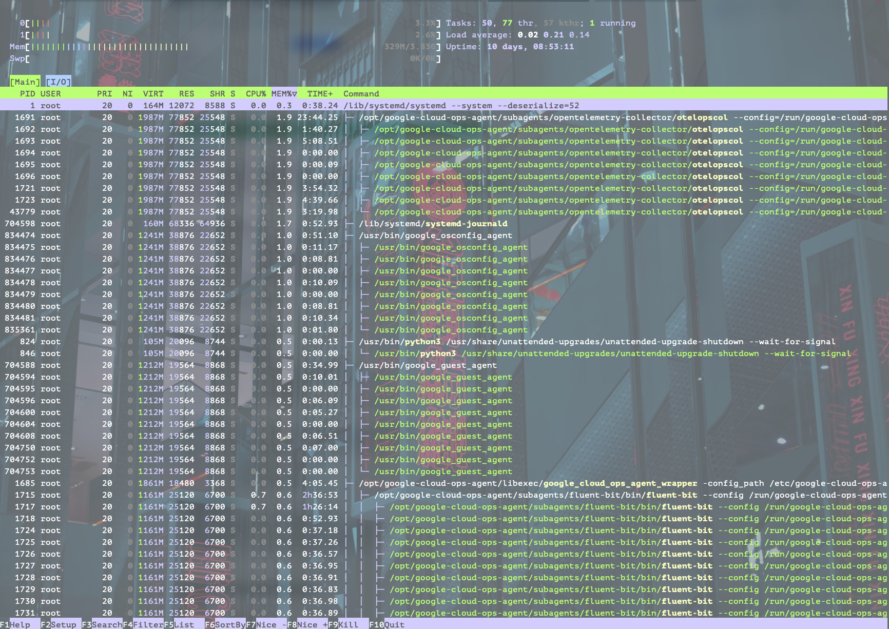
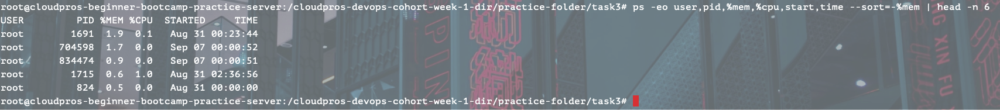
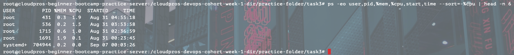

# Process Management Basics

### Objective

To learn how to mornitor and manage process on linux systems/servers.

### Requirements
#### Process Monitoring:
 - Capture a snapshot of all running processes
 - Identify the 5 processes using the most memory
 - Identify the 5 processes using the most CPU
 - Find all processes running as root user
 - Count total number of running processes
#### Process Control Exercise:
 - Start 3 sleep processes in the background (with different durations)
 - List all your background jobs
 - Bring one to foreground and then send it back to background
 - Kill all three processes using their PIDs
 - Verify they are terminated
#### Process Investigation:
 - Find the PID of the SSH service
 - Identify what process is using port 22
 - Document the parent PID of your current shell
 - Show the process tree for your session

### Acceptance Criteria
 - All process operations completed successfully
 - Clear documentation with timestamps
 - Explanation of PID and its importance
 - Safe handling of process termination

### Deliverables
 - process_snapshot.txt - Initial process monitoring
 - process_exercise.txt - Background process exercise documentation
 - process_notes.txt - Your understanding of process management

### File Structure
 - process-management
   - my_history.txt
   - process_exercise.txt
   - process_notes.txt
   - process_snapshot.txt
   - readme.md  

#### View all processes using htop.

#### Top 5 memory-consuming processes.

#### Top 5 CPU-consuming processes.

